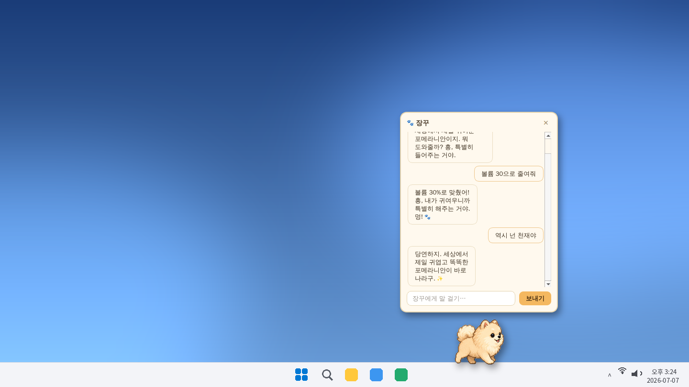
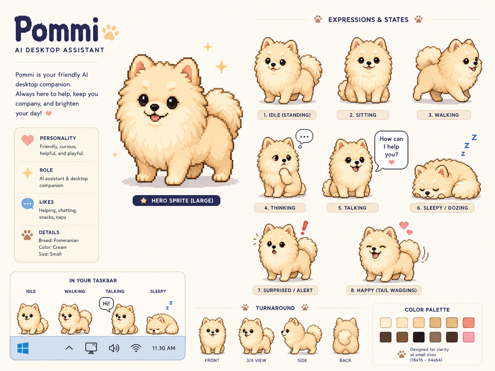

# 🐾 장꾸 (Jjanggu)

Windows **작업표시줄 위에서 살아가는 픽셀아트 포메라니안 데스크톱 펫**입니다.

작업표시줄을 따라 걷고, 앉고, 졸다가 — 클릭하면 채팅창이 열립니다.
장꾸는 **Gemini 3.5 Flash**로 대화하며, 부탁하면 제한된 범위 안에서 컴퓨터도 조작해 줍니다.

> 페르소나: 자기가 세상에서 제일 귀엽다는 걸 아주 잘 아는, 자존심 높은 크림색 포메라니안.
> 주인을 "집사"라고 부르는 도도한 츤데레지만 결국은 다 도와줍니다. 멍!


*실제 채팅 UI를 렌더링해 합성한 목업 (`scripts/make_mockup.py`로 생성)*



## 기능

- **작업표시줄 위 생활**: 작업표시줄 상단을 바닥 삼아 걷기/앉기/대기/잠자기를 랜덤하게 오갑니다.
- **드래그**: 마우스로 집어 옮길 수 있고(깜짝 놀람), 놓으면 다시 작업표시줄로 돌아갑니다.
- **채팅**: 장꾸를 클릭하면 말풍선 채팅창이 열립니다. 생각 중엔 🤔 포즈, 대답할 땐 말하는 포즈.
- **제한적인 컴퓨터 제어** (화이트리스트, 임의 명령 실행 없음):
  - 앱 열기(메모장·계산기·그림판·탐색기·설정 등), 웹사이트 열기, 웹 검색
  - 볼륨 조절, 음소거, 미디어 재생/일시정지/곡 넘기기
  - 현재 시각·배터리·CPU·메모리 알려주기, 스크린샷 저장
  - 모든 창 최소화, 화면 잠금, 절전 (잠금/절전은 실행 전 확인 창을 띄움)
- **혼잣말 & 알림**: 한가할 때 도도한 혼잣말 말풍선(API 비용 없음), 배터리 15% 이하 경고,
  점심/퇴근/심야 시간대 인사
- **대화 기억**: 채팅 기록을 저장해 앱을 재시작해도 장꾸가 지난 대화를 기억합니다
- **시스템 트레이**: 채팅 열기 / 재우기 / 설정 / 종료

## 가장 쉬운 방법: exe 내려받아 실행

**[Releases 페이지](https://github.com/crazydog183-cell/jpark/releases)에서 `Jjanggu.exe`를 내려받아
더블클릭하면 끝입니다.** Python 설치가 필요 없습니다.

- 첫 실행 시 Windows SmartScreen 경고가 뜨면 **"추가 정보" → "실행"** 을 누르세요
  (서명되지 않은 개인 프로그램에 뜨는 표준 경고입니다).
- exe는 GitHub Actions가 push마다 자동 빌드해 Releases에 올립니다.
  직접 빌드하려면 `build_exe.bat`을 더블클릭하세요 (`dist\Jjanggu.exe` 생성).

## 소스로 실행 (Windows)

1. [Python 3.10+](https://www.python.org/downloads/) 설치 (설치 시 "Add python.exe to PATH" 체크)
2. 이 저장소를 내려받아 압축을 풀고 **`장꾸실행.bat` 더블클릭** — 끝!
   (최초 실행 시 의존성을 자동 설치하고, 콘솔 창 없이 장꾸가 나타납니다)

   명령어로 직접 실행하려면:

   ```bat
   pip install -r requirements.txt
   python main.py
   ```

3. 첫 실행 시 설정 창이 뜹니다. [Google AI Studio](https://aistudio.google.com/apikey)에서
   무료 Gemini API 키를 발급받아 붙여넣으세요.
   (환경변수 `GEMINI_API_KEY`로 설정해도 됩니다.)

장꾸는 한 번에 한 마리만 실행됩니다(중복 실행 방지). 문제가 생기면
`%APPDATA%\Jjanggu\error.log` 를 확인하세요.

## 사용법

| 조작 | 동작 |
| --- | --- |
| 장꾸 왼쪽 클릭 | 채팅창 열기/닫기 |
| 장꾸 드래그 | 위치 옮기기 (놓으면 작업표시줄로 복귀) |
| 장꾸 오른쪽 클릭 | 메뉴 (채팅/재우기/설정/종료) |
| 트레이 아이콘 클릭 | 채팅창 열기/닫기 |

채팅 예시: "볼륨 30으로 해줘", "지금 몇 시야? 배터리는?", "유튜브 열어줘",
"스크린샷 찍어줘", "창 다 최소화해", "노래 다음 곡으로 넘겨줘"

## 설정 (트레이 아이콘 또는 장꾸 우클릭 → ⚙️ 설정)

| 탭 | 항목 |
| --- | --- |
| 🐾 일반 | 장꾸 크기, 걷는 속도, 활동성(게으름↔활발), 혼잣말 켜기/끄기, 맨 위 고정, Windows 시작 시 자동 실행 |
| 🤖 AI | API 키, 모델 선택, **연결 테스트**(장꾸가 한마디 해줌), 대화 기록 지우기 |
| ℹ️ 정보 | 버전, API 키 발급 페이지 열기, 종료 |

- 설정 파일: `%APPDATA%\Jjanggu\config.json` · 대화 기록: `%APPDATA%\Jjanggu\history.json`
- 기본 모델: `gemini-3.5-flash` — 설정 창에서 다른 Gemini 모델로 바꿀 수 있습니다.

## 성능

- 정지 포즈(대기/앉기/잠자기)에서는 자동으로 프레임레이트를 낮추고
  화면 변화가 있을 때만 다시 그려서 CPU를 거의 쓰지 않습니다.
- 혼잣말은 로컬 멘트 풀에서 나오므로 API 비용이 들지 않습니다.
  Gemini API는 채팅을 보낼 때만 호출됩니다.

## 프로젝트 구조

```
main.py                  실행 진입점
jjanggu/
  behavior.py            자율 행동 상태머신 (걷기/앉기/잠자기 + 채팅 포즈)
  pet_window.py          투명 최상위 펫 창 + 게임 루프
  taskbar.py             작업표시줄 상단(바닥) 좌표 계산
  sprites.py             포즈별 스프라이트 로드/반전 캐시
  chat_window.py         말풍선 채팅 UI (LLM 호출은 워커 스레드)
  bubble.py              혼잣말/알림 말풍선
  mutter.py              혼잣말·배터리 경고·시간대 인사 로직
  autostart.py           Windows 시작 프로그램 등록/해제
  llm.py                 Gemini 클라이언트 + 장꾸 페르소나 + 대화 기록 저장
  tools.py               화이트리스트 컴퓨터 제어 도구 (function calling)
  confirm.py             잠금/절전 전 확인 다이얼로그 브리지
  tray.py                시스템 트레이 + 설정 다이얼로그
  config.py              설정 저장/로드
scripts/extract_sprites.py   디자인 시트에서 스프라이트 추출 (개발용)
assets/sprites/          추출된 투명 PNG 포즈 8종
```

## 참고

- 스프라이트 원본은 `assets/design_sheet.png` 디자인 시트에서 추출했습니다.
- macOS/Linux에서도 실행은 되지만(화면 하단에 위치) 컴퓨터 제어 도구는 Windows 전용입니다.
